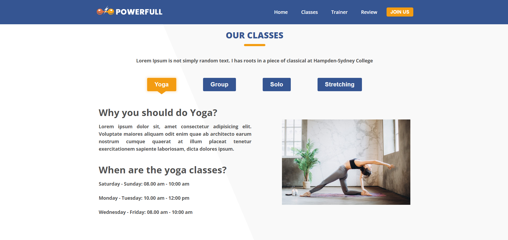
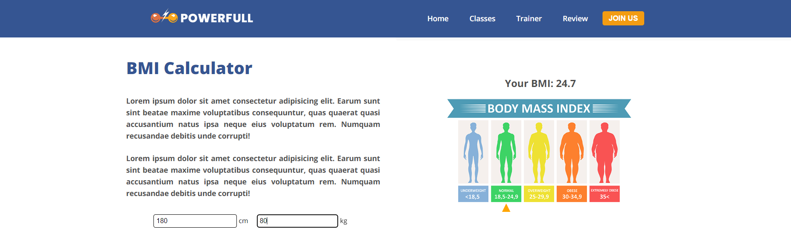
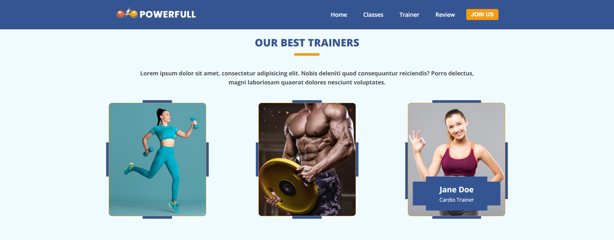
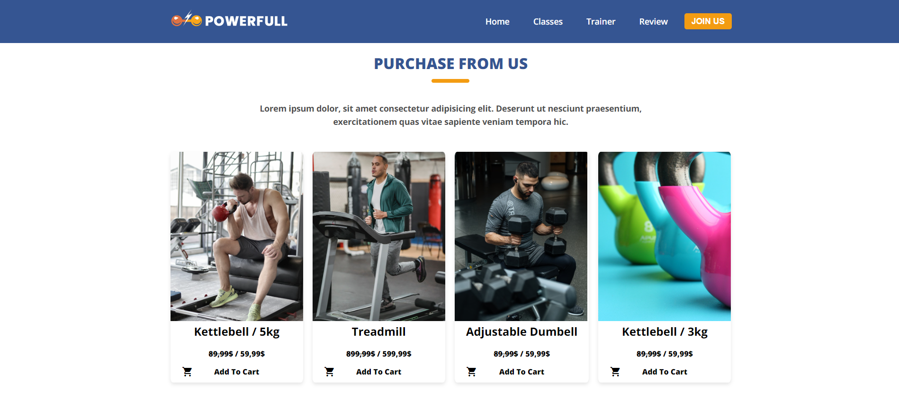
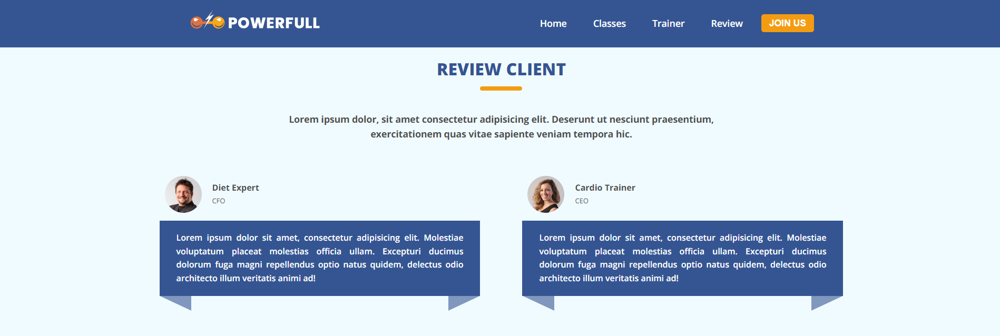
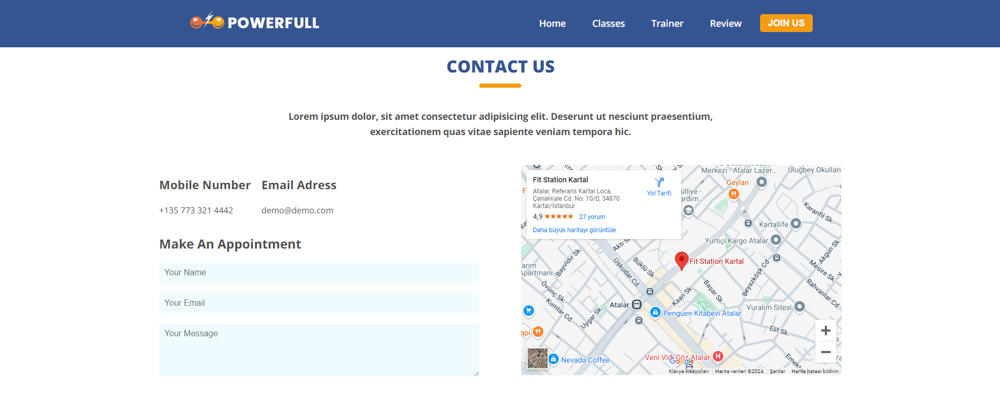

# Sport Center Website

## Go to Website

## Features

- Navbar: Fixed and scroll event sensitive.
- Hero Section: Impressive visual background and call buttons.
- Statistics: Centralized information with centralized dashboards.
- Classes: Ability to switch between various classes such as Yoga, Group, Solo and Stretching.
- Instructors: Cards introducing our best instructors.
- Buyable Products: Sports equipment and accessories.
- Customer Reviews: Real user reviews.
- Contact Form: Easy to contact and map integration.
- Responsive Design: Compatible appearance on every device.

## Screenshots

### Home Page

### Classes Section

### BMI Calculator

### Trainers Section

### Purchase Section

### Review Section

### Contact Us Section

### Footer

# Web Interactive Features Project

## Description

This project includes various interactive features for a web application, implemented using HTML, CSS, and JavaScript. Key functionalities include a responsive navigation bar with scroll effects, a hamburger menu for mobile navigation, section switching based on button clicks, and a Body Mass Index (BMI) calculator.

## Interactive Features

### 1. Navbar Scroll Effect

- The navbar changes its style based on the scroll position. When the user scrolls beyond the height of the navbar, it applies a `nav-scroll` class to change its appearance.

### 2. Hamburger Menu

- A hamburger menu is available for mobile devices, allowing users to toggle navigation visibility. The menu expands and collapses based on user interaction.

### 3. Section Switching

- Users can click on buttons to display different sections of content dynamically. This is achieved by hiding all sections and showing only the targeted section.

### 4. BMI Calculator

- The BMI calculator allows users to input their height and weight, calculates the BMI, and displays the result along with a pointer indicating their BMI category on a scale.

## Technologies Used

- HTML
- CSS
- JavaScript
- React
